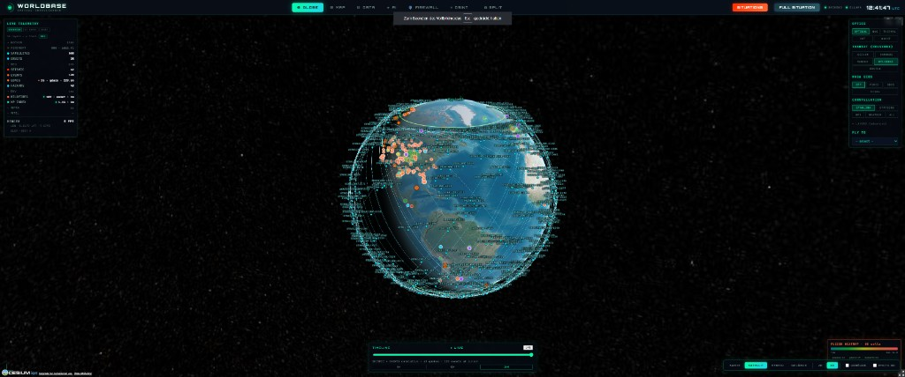
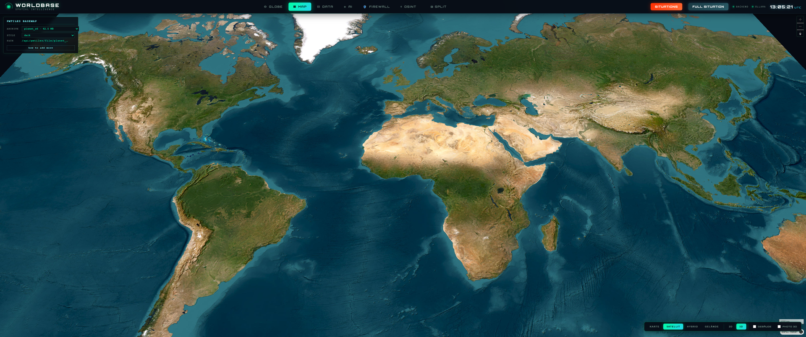
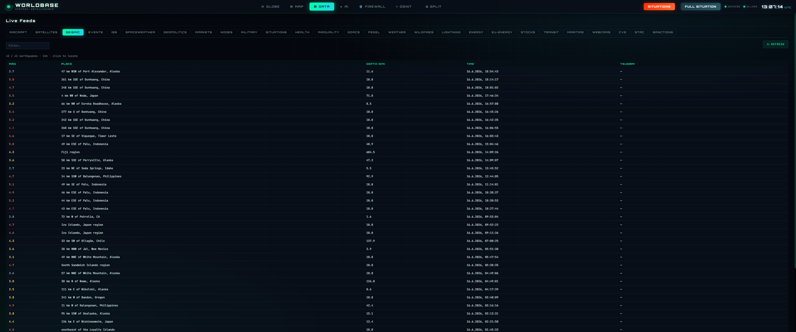
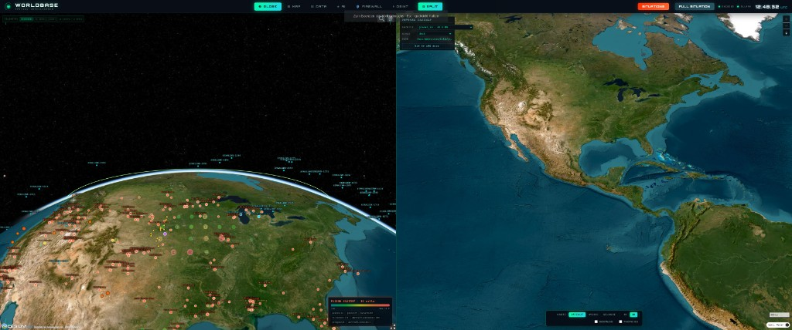

# intelshed


**Spatial Open Intelligence Shed** — OSINT feeds on a Cesium globe, fusion analytics, local AI chat, and optional Pi edge sync.

intelshed is designed for OSINT analysts and security researchers who require a local, offline-capable platform for situational awareness. It combines 30+ live data feeds, a FollowTheMoney entity graph, hybrid RAG, and a 24h security briefing with agentic verification — without cloud dependency for core functions.

intelshed is an integration layer over existing libraries, datasets, and tools. See [`THIRD_PARTY_NOTICES.md`](THIRD_PARTY_NOTICES.md) for attributions.

`FastAPI` · `React` · `Vite` · `SQLite` · `DuckDB` · `Ollama` · `NVIDIA NIM` · `Docker` · optional `Pi` edge sync

intelshed is the **PC stack**. It extends the off-grid Pi workshop ([`offgrid-raspi`](https://github.com/sookoothaii/offgrid-raspi)) with fusion, a 24h security briefing, and globe UX. Run intelshed alone on a PC, or Pi + PC together via push/pull sync (see below).

---

## At a glance

| Category | Description |
|---|---|
| **Globe** | 30+ live layers — aircraft, quakes, disasters, energy, maritime, transit, dark web |
| **MAP** | Offline Protomaps via PMTiles — regional or full planet (~130 GB) |
| **Briefing** | 24h security digest (LOCAL / REGION / GLOBAL), watch items, prediction ledger, agentic loop, two-pass critique-refine |
| **Intelligence** | FtM entity graph (DuckDB), OpenSanctions, hybrid RAG (sqlite-vec + FTS5 + RRF + BGE rerank), GraphRAG-lite |
| **AI** | Ollama (`qwen3:8b`) + 6 cloud providers (NVIDIA NIM, Groq, OpenRouter, Cerebras, SambaNova, DeepSeek); 4-layer anti-hallucination stack |
| **OSINT** | Dark web (P8, 8 search engines + Tor), ransomware intel, identity enumeration (P9, 83 platforms), Telegram SOCMINT, satellite change detection |
| **Entity resolution** | Per-dataset dedupe → cross-dataset link (Splink), dual-pipeline, human-in-the-loop labelling, FtM 4.0 StatementEntity |
| **Multi-agent** | 5-agent orchestrator (Coverage → Retrieval → Spatial → Corroboration → Synthesis) + blackboard + evidence chains, 0 VRAM |
| **Anomaly detection** | Isolation Forest on 8 feed time series (V4-23), River HalfSpaceTrees on live streams, CPU-only |
| **Predictive** | LightGBM forecasting on snapshot time series (V4-19), 24h entity count forecast |
| **Edge** | Off-grid Pi pushes sensors → PC fuses → briefing pull back to Pi (delta sync + conflict detection) |
| **Trust** | Rule-based briefing quality + feed drift + connector provenance + route outcome ledger (`GET /api/trust`) |
| **MCP** | Cursor/Claude: 13 tools — briefing, nodes, feeds, globe control — [`docs/MCP.md`](docs/MCP.md) |
| **Docker** | Full stack: backend + Caddy (TLS) + Redis + Celery worker/beat + Flower — `docker compose up -d --build` |
| **Approach** | Situational awareness for decision support — not an attack tool |

Full feature catalog with env vars and setup → [`docs/FEATURES.md`](docs/FEATURES.md)

---

## Quick start

**Prerequisites:** Docker, [Ollama](https://ollama.com/) with models pulled (`qwen3:8b`, `nomic-embed-text`), free [Cesium Ion](https://ion.cesium.com/tokens) token. Optional: [NVIDIA NIM API key](https://build.nvidia.com/) for cloud reasoning models.

```bash
ollama pull qwen3:8b
ollama pull nomic-embed-text   # required for RAG embeddings
```

### Docker (default)

```bash
git clone https://github.com/sookoothaii/intelshed.git
cd intelshed
git submodule update --init --recursive   # Pi sync scripts in offgrid-raspi/
cp backend/.env.example backend/.env      # API keys, feature flags
cp frontend/.env.example frontend/.env    # required: VITE_CESIUM_ION_TOKEN
docker compose up -d --build
```

| Service | URL |
|---------|-----|
| **UI** | https://localhost (accept self-signed cert) |
| **API** | https://localhost/api/docs |
| **Health** | https://localhost/api/health/ping |
| **Flower** | http://localhost:5555 (Celery dashboard) |

**API key:** Retrieve with `docker compose exec backend python -c "import os; print(os.getenv('WORLDBASE_API_KEY','NOT_SET'))"`. Use as `X-API-Key` header for authenticated endpoints.

> **Warning:** If `WORLDBASE_API_KEY` is not set in `backend/.env`, all API endpoints are open without authentication. Set a key for any instance exposed beyond localhost.

**Docker notes:**
- `docker compose down` stops services; `docker compose down -v` also wipes the database volume — use with caution.
- Caddy uses a self-signed TLS certificate. Browsers will warn — proceed or accept. For `curl`, use `-k` to skip verification. On Windows, `curl` may return empty even with `-k`; use a browser or `Invoke-WebRequest -SkipCertificateCheck` in PowerShell.
- Do not run the venv backend and Docker stack simultaneously — they use separate databases, causing data divergence.
- Feature flags at `GET /api/admin/flags` may show `enabled: false` when not explicitly set in `.env`. Code defaults in `config.py` / `features.py` apply at runtime. See [`AGENTS.md`](AGENTS.md) for details.

### Native / venv (development only)

For local development without Docker. Requires Python 3.12+, Node.js 20+.

```bash
git clone https://github.com/sookoothaii/intelshed.git
cd intelshed
git submodule update --init --recursive
cp backend/.env.example backend/.env
cp frontend/.env.example frontend/.env
python -m venv backend/venv
source backend/venv/bin/activate          # Linux/macOS
# backend\venv\Scripts\activate            # Windows
pip install -r backend/requirements.txt
# Start backend + frontend (see start.ps1 or start.sh)
```

| Service | URL (venv mode) |
|---------|-----|
| **UI** | http://localhost:5176 |
| **API** | http://localhost:8002/docs |
| **Health** | http://localhost:8002/api/health |
| **Ollama** | http://127.0.0.1:11434 |

**Verify stack (venv):** `./scripts/smoke-test.ps1` (Windows) or `./scripts/smoke-test.sh` (Linux) → 33 checks. This script targets the venv backend at `127.0.0.1:8002`, not the Docker stack.

Optional Python packages (venv only — Docker image includes these):

```bash
# BGE reranker (CPU or GPU):
pip install sentence-transformers   # when RAG_RERANK=1 in backend/.env
# Anomaly detection (Isolation Forest):
pip install scikit-learn            # when WORLDBASE_ANOMALY_DETECTION=1
# Predictive analytics (LightGBM):
pip install lightgbm numpy          # when WORLDBASE_PREDICTIVE=1
```

### MCP + Agent Bus (optional)

For Cursor / Claude automation — full guide: [`docs/MCP.md`](docs/MCP.md).

```powershell
# backend/.env
WORLDBASE_MCP=1
WORLDBASE_MCP_WRITE=1
WORLDBASE_AGENT_BUS=1          # globe fly_to / layer toggle via MCP

# frontend/.env
VITE_WORLDBASE_AGENT_BUS=1     # HUD must be open
```

MCP endpoint: `https://localhost/api/mcp` (Docker) or `http://127.0.0.1:8002/api/mcp` (venv). Requires `X-API-Key` header when `WORLDBASE_API_KEY` is set. 13 tools available when Agent Bus is enabled. Per-tool RBAC policy enforced (read tools → `readonly`, write tools → `operator`).

### Screenshots

| GLOBE | MAP | DATA | SPLIT |
|-------|-----|------|-------|
|  |  |  |  |

Full set: [`docs/screenshots/`](docs/screenshots/README.md)

### Docker stack with Pi sync

The Docker stack includes Pi sync endpoints. To start with LAN auto-detection and node token:

```bash
./scripts/start-docker.sh         # Linux
# .\scripts\start-docker.ps1     # Windows
```

Pi sync details → [`offgrid-raspi/docs/WORLDBASE_PI_SYNC.md`](offgrid-raspi/docs/WORLDBASE_PI_SYNC.md) · Linux migration → [`docs/LINUX_MIGRATION_PLAN.md`](docs/LINUX_MIGRATION_PLAN.md)

---

## What works without keys

Most feeds are fail-soft (stale cache or empty payload on upstream errors — the globe does not crash).

| Tag | Layers | Key |
|-----|--------|-----|
| `no-key` | Aircraft (adsb.fi / adsb.lol), USGS, EONET, GDACS, SMARD, IODA outages, pegel, ISS, CelesTrak | — |
| `recommended` | NASA FIRMS wildfires, Cloudflare Radar outages | free signup |
| `optional` | OpenSky OAuth (recommended for full ADS-B), ENTSO-E EU energy, Blitzortung lightning, AISstream, ReliefWeb | varies |
| `required` | Cesium terrain/imagery | [Ion token](https://ion.cesium.com/tokens) |

Docker: `GET https://localhost/api/health` · `GET https://localhost/api/trust` · `GET https://localhost/api/credentials/status` (add `X-API-Key` header if `WORLDBASE_API_KEY` is set). venv: replace with `http://127.0.0.1:8002/api/...`. Templates: `backend/.env.example`, `frontend/.env.example`.

---

## Architecture

```
Docker mode:
┌─────────────────────────────────────────────────────────┐
│  Caddy TLS reverse proxy                    :443         │
│  https://localhost → SPA + /api/* proxy to backend      │
└───────────────────────────┬─────────────────────────────┘
                            │
┌───────────────────────────▼─────────────────────────────┐
│  React + CesiumJS (+ MapLibre 2D)   served by Caddy      │
│  Globe · DATA · AI chat · Agent Bus · Agent Swarm       │
└───────────────────────────┬─────────────────────────────┘
                            │ /api/*
┌───────────────────────────▼─────────────────────────────┐
│  FastAPI + SQLite + DuckDB                  :8002        │
│  MCP · Agent Bus · hybrid RAG · briefing agentic loop   │
│  5-agent orchestrator · anomaly detection · predictive  │
│  4-layer anti-hallucination · /api/trust · provenance   │
│  Celery worker + beat · Redis cache/pubsub              │
└───────────────────────────┬─────────────────────────────┘
         ┌──────────────────┼──────────────────┐
         ▼                  ▼                  ▼
    USGS · NASA ·      Ollama :11434      Pi :443/ingest
    GDACS · SMARD …    qwen3 + RAG        (offgrid-raspi)
    30+ feeds          6 cloud providers   delta sync

venv mode: Caddy layer absent; Vite serves :5176, FastAPI on :8002.
```

Agent reference → [`AGENTS.md`](AGENTS.md) · MCP setup → [`docs/MCP.md`](docs/MCP.md)

---

## Documentation

**Operation & setup:**

| Doc | Purpose |
|-----|---------|
| [`AGENTS.md`](AGENTS.md) | Runtime, endpoints, key files, architecture notes, troubleshooting |
| [`docs/FEATURES.md`](docs/FEATURES.md) | Optional features — env vars, setup, guardrails |
| [`docs/DOCKER.md`](docs/DOCKER.md) | Docker stack operations, troubleshooting |
| [`docs/SECRETS.md`](docs/SECRETS.md) | Secret management — env, vault, Cesium token |

**Features & modules:**

| Doc | Purpose |
|-----|---------|
| [`docs/GLOBE.md`](docs/GLOBE.md) | Click-to-detail, layers, INTEL FtM, traffic cams |
| [`docs/DARKWEB.md`](docs/DARKWEB.md) | Dark Web OSINT (P8) — engines, Tor proxy, OPSEC |
| [`docs/TELEGRAM.md`](docs/TELEGRAM.md) | Telegram SOCMINT (K3) — channels, SEA scoring |
| [`docs/INTEL_INGEST.md`](docs/INTEL_INGEST.md) | Optional document intel ingest (GLiNER) |
| [`docs/FIREWALL.md`](docs/FIREWALL.md) | Slim prompt guard + optional HAK_GAL bridge |

**Roadmaps & migration:**

| Doc | Purpose |
|-----|---------|
| [`docs/WORLDBASE_ROADMAP_V4.md`](docs/WORLDBASE_ROADMAP_V4.md) | V4 roadmap — sprints, ADRs, shipped features |
| [`docs/WORLDBASE_ROADMAP_V2.md`](docs/WORLDBASE_ROADMAP_V2.md) | Compact roadmap — shipped items reference + open work |
| [`docs/LINUX_MIGRATION_PLAN.md`](docs/LINUX_MIGRATION_PLAN.md) | Migrate intelshed from Windows to Linux |

**Integration:**

| Doc | Purpose |
|-----|---------|
| [`docs/MCP.md`](docs/MCP.md) | Cursor MCP tools, Agent Bus, Docker gateway |
| [`offgrid-raspi/docs/WORLDBASE_PI_SYNC.md`](offgrid-raspi/docs/WORLDBASE_PI_SYNC.md) | Pi ↔ PC sync |
| [`THIRD_PARTY_NOTICES.md`](THIRD_PARTY_NOTICES.md) | Optional ML licenses, attribution, lineage |

---

## Pi + PC (two repos)

| Repo | Role | When you need it |
|------|------|------------------|
| **[intelshed](https://github.com/sookoothaii/intelshed)** (this repo) | Windows/Linux PC — Cesium globe, 30+ feeds, Ollama + NVIDIA NIM briefing, node API `:8002` | Spatial intelligence workstation; fusion and LLM digest |
| **[offgrid-raspi](https://github.com/sookoothaii/offgrid-raspi)** | Raspberry Pi — portal, sensors, mesh, offline services | Edge node that survives without mains; pushes telemetry to the PC |

**Together:** Pi `worldbase_push` → PC `POST /api/node/ingest` · PC briefing → Pi `GET /api/node/pull` (v3: ETag/304, SHA-256, conflict detection, `source: worldbase-pc`, briefing quality) → portal / LCD.  
**Canonical sync guide:** [`offgrid-raspi/docs/WORLDBASE_PI_SYNC.md`](offgrid-raspi/docs/WORLDBASE_PI_SYNC.md)

This repo vendors the Pi repo as a **git submodule** at `offgrid-raspi/` (scripts + sync docs). The Pi itself clones `offgrid-raspi` separately; the PC clones `intelshed` and initializes submodules when you work on push/pull scripts.

**PC UI — EDGE dashboard:** In the HUD, open **DATA → EDGE** for live Pi stats (CPU/RAM/disk/load/uptime, room DHT, services, mesh) and 24h sparklines. The header shows **EDGE ONLINE** when `offgrid-pi` has pushed within 5 minutes (`GET /api/nodes`).

### Operator checks

Docker mode (add `-k` for self-signed cert, `-H "X-API-Key: <key>"` if `WORLDBASE_API_KEY` is set):

| Check | Command |
|-------|---------|
| Health | `curl -sk https://localhost/api/health/ping` |
| Nodes | `curl -sk -H "X-API-Key: <key>" https://localhost/api/nodes` |
| Trust probes | `curl -sk -H "X-API-Key: <key>" https://localhost/api/trust` |
| Anomaly status | `curl -sk -H "X-API-Key: <key>" https://localhost/api/anomalies/iso/status` |
| Graph stats | `curl -sk -H "X-API-Key: <key>" https://localhost/api/intel/graph/stats` |
| Pi pull payload | `curl -sk -H "X-Node-Token: <token>" https://localhost/api/node/pull` |
| Deploy push/pull scripts | `./scripts/deploy-pi-sync.ps1` (Windows) |
| Pi disk maintenance | `sudo bash pi-disk-maintenance.sh` (on Pi) |

venv mode: replace `https://localhost` with `http://127.0.0.1:8002` and omit `-k`.

---

## License

MIT — see repository terms for intelshed core code.

Optional features (document intel ingest, external feeds, downloaded models) may pull in **separate third-party licenses**. In particular, **GLiREL relation extraction is disabled by default** because it is CC BY-NC-SA (non-commercial). See [`THIRD_PARTY_NOTICES.md`](THIRD_PARTY_NOTICES.md) and [`docs/INTEL_INGEST.md`](docs/INTEL_INGEST.md).
